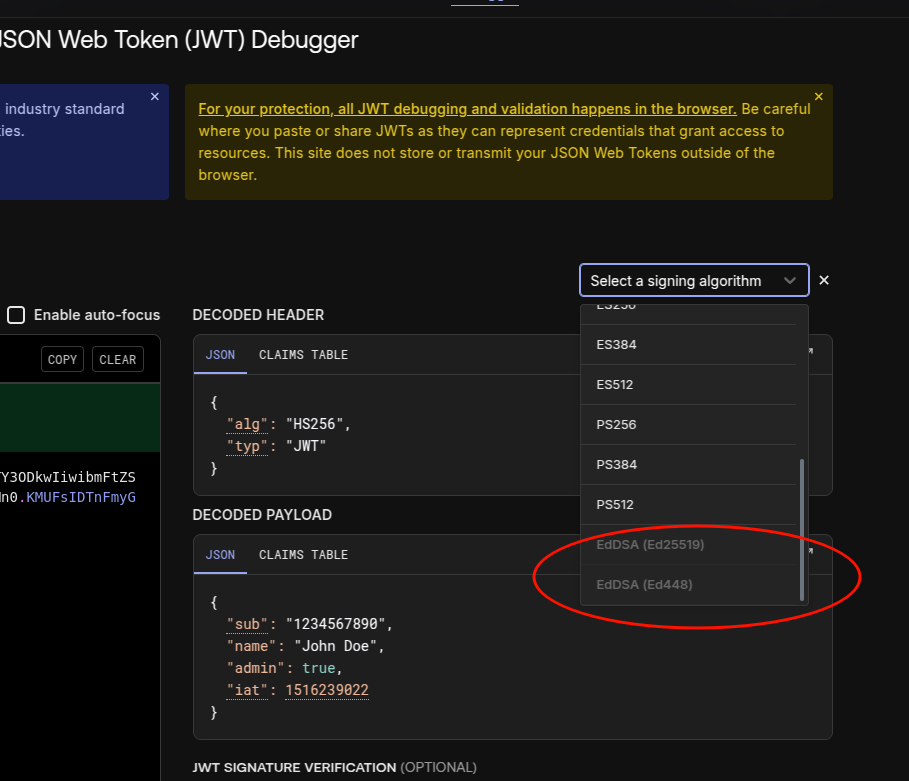
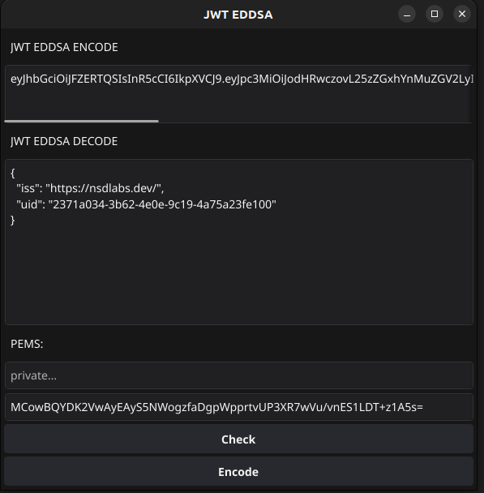

# JWT_EdDSA

Since jwt.io currently does not support verifying tokens signed with EdDSA, which is one of the algorithms I use most often, I decided to build a simple tool to manually generate and verify tokens.
I only had a couple of hours to work on it, so for now it’s a basic but functional version.

openssl genpkey -algorithm ed25519 -out ed25519_priv.pem
openssl pkey -in ed25519_priv.pem -pubout -out ed25519_pub.pem